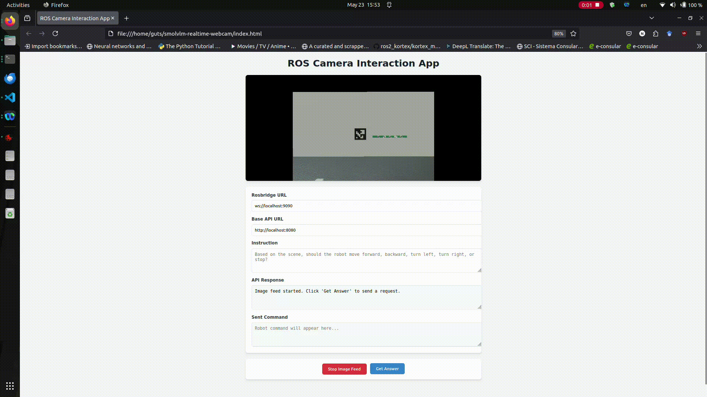

# SmolVLM Real-Time ROS Camera Demo



This repository provides a simple web demo for using the [llama.cpp](https://github.com/ggml-org/llama.cpp) server with the SmolVLM 500M model to perform real-time scene understanding and robot command generation from a ROS camera feed.

## Features

- Connects to a ROS image topic via [rosbridge](https://github.com/RobotWebTools/rosbridge_suite)
- Sends camera images and instructions to a llama.cpp multimodal API
- Maps model responses to robot movement commands (`/cmd_vel`)
- Simple web UI for interaction and visualization

## Setup Instructions

1. **Install llama.cpp**  
   Follow the instructions at [llama.cpp](https://github.com/ggml-org/llama.cpp) to build and set up the server.

2. **Download a Multimodal Model**  
   For example, SmolVLM 500M:  
   ```
   llama-server -hf ggml-org/SmolVLM-500M-Instruct-GGUF
   ```
   - Add `-ngl 99` to enable GPU acceleration (if supported).
   - You can try other models as described [here](https://github.com/ggml-org/llama.cpp/blob/master/docs/multimodal.md).

3. **Start rosbridge**  
   ```
   ros2 launch rosbridge_server rosbridge_websocket_launch.xml
   ```
   (Or the equivalent for your ROS version.)

4. **Open the Web UI**  
   Open `index.html` in your browser.  
   - Set the Rosbridge URL (default: `ws://localhost:9090`)
   - Set the llama.cpp API URL (default: `http://localhost:8080`)
   - Optionally edit the instruction prompt.

5. **Start the Image Feed**  
   Click "Start Image Feed" to begin streaming images from your ROS topic.

6. **Get Model Response**  
   Click "Get Answer" to send the current image and instruction to the model.  
   The model's response will be mapped to a robot command and published to `/cmd_vel`.

## Notes

- The default ROS image topic is `/kinova_color/image_color/compressed`.  
  Change this in `index.html` if your camera publishes to a different topic.
- The web UI requires [roslibjs](https://github.com/RobotWebTools/roslibjs) (included via CDN).
- For best results, use a Chromium-based browser.

## Example Instruction

```
Based on the scene, should the robot move forward, backward, turn left, turn right, or stop?
```

## License

MIT
